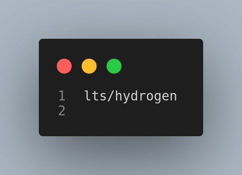

# Node Setup

Probably, you already have a Node.JS version running in your machine, but we will learn how to manage and decide in which version we want to work with using `nvm`.

Let's start by running the `node -v` command on our terminal:

I have already `Node v18.15.0`, but we will learn how to choose and change between any version you need.

To see what version I have installed in my machine let's run the `nvm ls` command, which stands for `node version manager list`.

In my case, I want `lts/hydrogen` version which is not listed, but we can install it by running `nvm install lts/hydrogen`

If we check running `nvm ls` again, we should se some different output than the last time.

You can see that now there is an arrow pointing to `v18.16.1`. It is our desired version.

If we run `node -v` now we see the version that we want to use.

---

## Important to know

If we open a new tab at our terminal, and run `node -v`...

We will see the version that is previously installed.

Dont worry, we will handle that know.
We can use the command `nvm alias default lts/hydrogen`.

Let's check one more time with `nvm ls`.

Now we have `default -> lts/hydrogen (-> v18.16.1)`

And by opening a new terminal and running `node -v` we should have our default node version printed to the terminal.

---

## Adding .nvmrc

We can use this file to specify to our nvm which version we want to install, this can be useful when working on a project and within the project folder we want that version to be used when working with other people.

Start by creating a file at the root folder of your project called `.nvmrc`.
Open it in your editor, and add in the first line the version you want:

And in your terminal run: `nvm install`

It will search for `.nvmrc` and will install the version you specified there.
