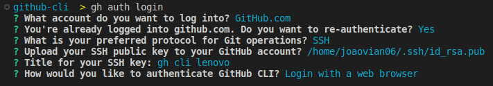
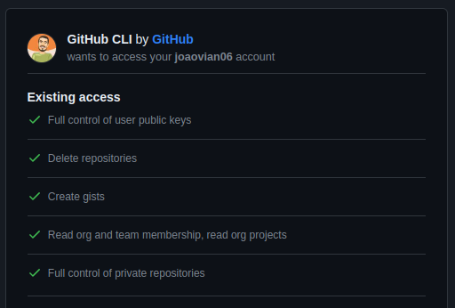
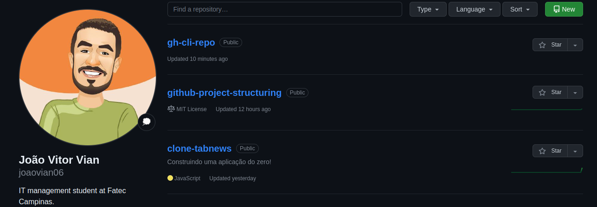
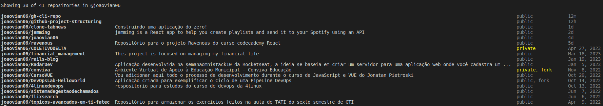

# GitHub CLI Basic Usage

## Installing

Check the documentation [here](https://github.com/cli/cli/blob/trunk/docs/install_linux.md) for debian based systems.

```bash
type -p curl >/dev/null || (sudo apt update && sudo apt install curl -y)
curl -fsSL https://cli.github.com/packages/githubcli-archive-keyring.gpg | sudo dd of=/usr/share/keyrings/githubcli-archive-keyring.gpg \
&& sudo chmod go+r /usr/share/keyrings/githubcli-archive-keyring.gpg \
&& echo "deb [arch=$(dpkg --print-architecture) signed-by=/usr/share/keyrings/githubcli-archive-keyring.gpg] https://cli.github.com/packages stable main" | sudo tee /etc/apt/sources.list.d/github-cli.list > /dev/null \
&& sudo apt update \
&& sudo apt install gh -y
```

Check installation:

```bash
gh version
```

The lastest version at 07-08-2023 is:

`gh version 2.31.0 (2023-06-20)`

---

## Upgrading

```bash
sudo apt update
sudo apt install gh
```

---

## Authorization

```bash
gh auth login
```



GitHub will provide you a 8 caracters Hexadecimal code, copy that and paste it when the new tab opens.
After that, you should see something like this:



After authorizing, if you have 2FA, you can use the GitHub Mobile App to authenticate.


Once the authentication is complete, we are ready to start using it.

---

## Adding Milestones

Now you can use all of GitHub CLI features.

But before we proceed, lets do one more configuration, so we can also manipulate Milestone.

As you can check in this [repository](https://github.com/valeriobelli/gh-milestone), created to incorporate Milestone into GitHub CLI which is not present by default.

### Installing

```bash
gh extension install valeriobelli/gh-milestone
```

---

## Now we are ready to explore...

### Basic Commands

#### Repository

Lets start by creating a repository:

```bash
gh repo create
```

The interface will guide you to interactively create a repository by selecting which attributes you would like your repository to have.


Now that our repository is created, lets check in the browser how everything looks like.



As you can see, now our repository is listed at our GitHub account.
But, there is a cooler way to checked that:

```bash
gh repo list
```



And there is a list of our repositories. Cool right?

We have a lot more options to manipulate ou repositories, you can check all of its possibilities [here](https://cli.github.com/manual/gh_repo).
